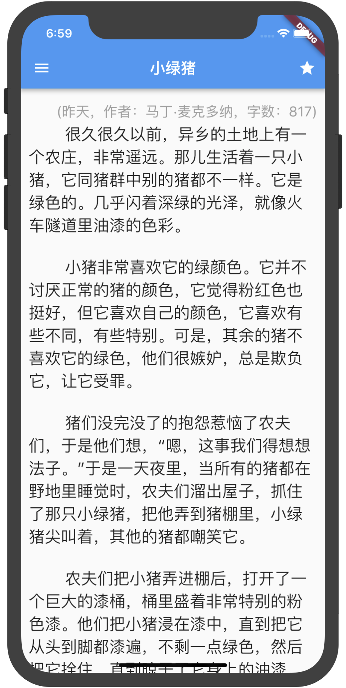
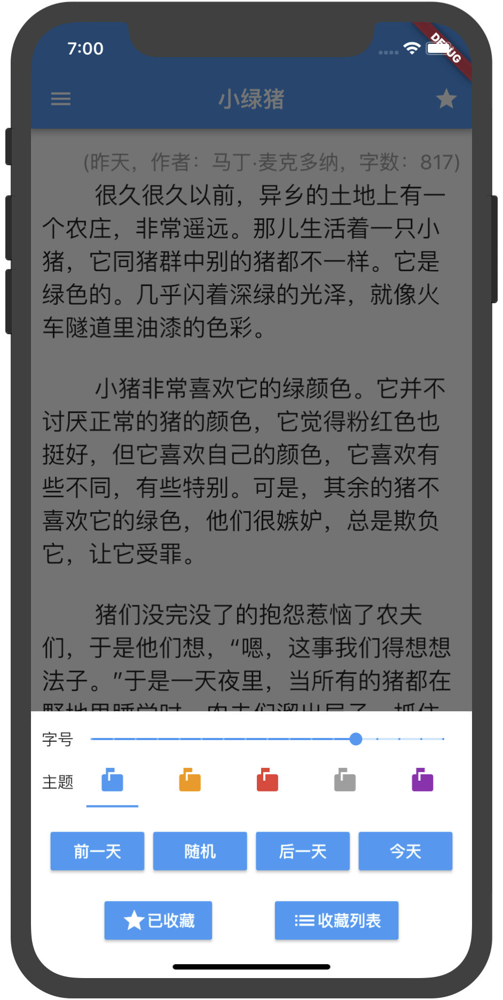
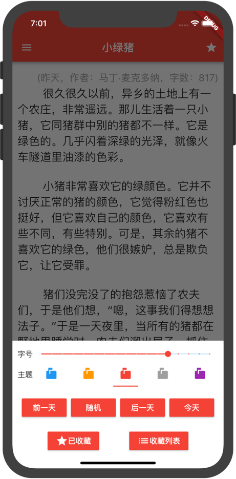
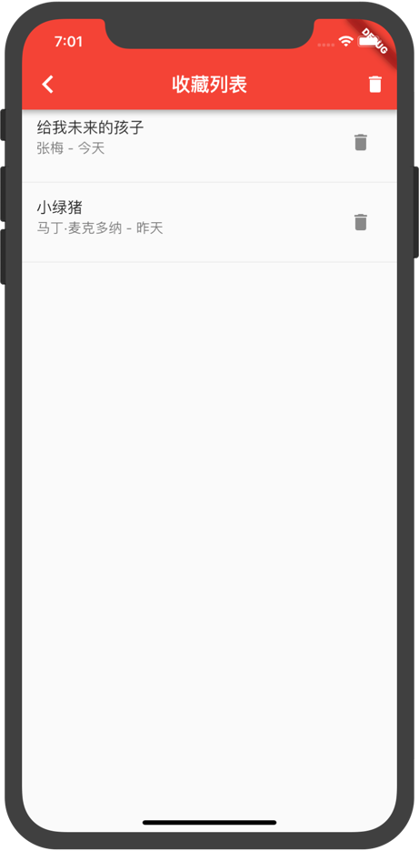

# 一文

[English](./README.md) | 简体中文

基于[每日一文 API](https://meiriyiwen.com/) 开发的一款全新的 Flutter App。

本项目仅供学习，如有侵权请[联系本人](mailto:chengww5217@163.com)进行删除。

API 来源：[https://github.com/jokermonn/-Api/blob/master/OneArticle.md](https://github.com/jokermonn/-Api/blob/master/OneArticle.md)

安卓下载地址：[https://github.com/chengww5217/one_article/releases](https://github.com/chengww5217/one_article/releases)

### 功能要点

- 联网解析文章，本地数据库保存。
- 主题切换，字体调整，配置本地保存。
- 收藏文章，删除收藏文章。
- 可切换文章日期。
- 支持中英文，虽然文章都是中文的。

### 截图

