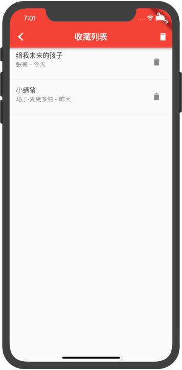

# One Article

English | [简体中文](./README-zh_CN.md)

A new Flutter App based on [meiriyiwen.com API](https://meiriyiwen.com/).

This project is for study only.

If there is any infringement, please [contact me](mailto:chengw5217@163.com) to delete.

API : [https://github.com/jokermonn/-Api/blob/master/OneArticle.md](https://github.com/jokermonn/-Api/blob/master/OneArticle.md)

Android Download: [https://github.com/chengww5217/one_article/releases](https://github.com/chengww5217/one_article/releases)

### Highlights

- Parsing network articles with json, local database saved.
- Theme switching, font adjustment, these configurations are saved locally.
- Starred articles, delete starred articles.
- Switch article with date.
- Support Chinese and English, although the articles are in Chinese.

### ScreenShots

